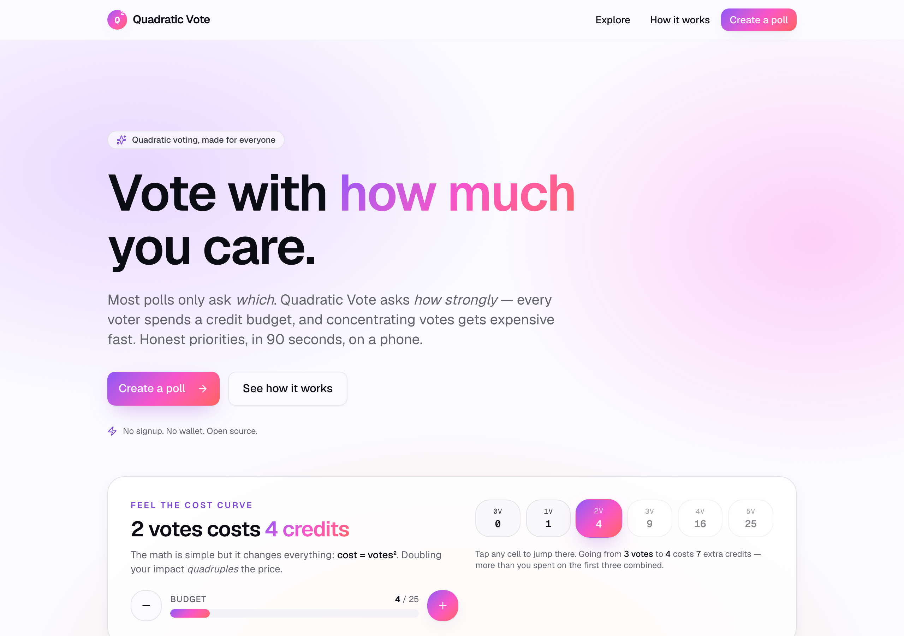
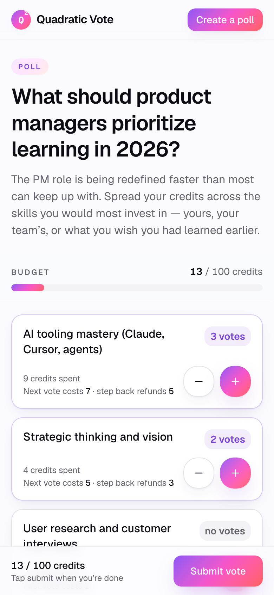
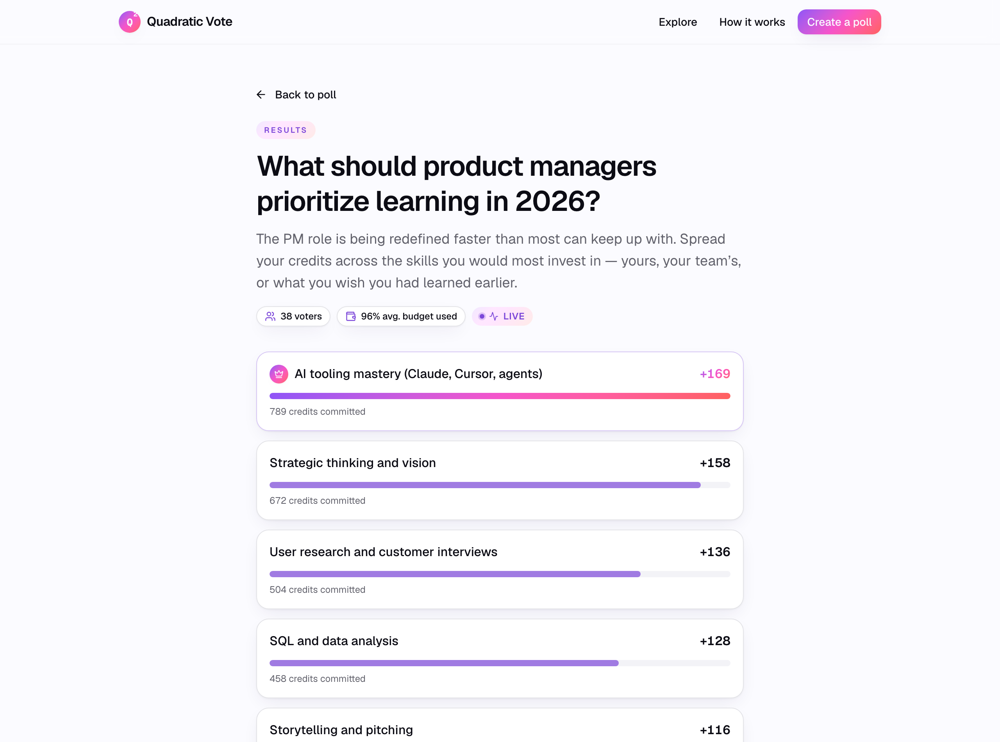
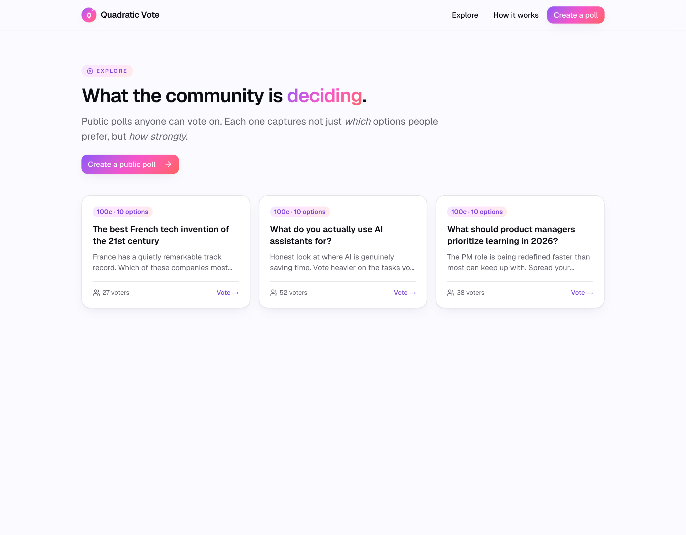

# Quadratic Vote

**Vote with _how much_ you care — not just _which_ you prefer.**

A quadratic-voting web app built for people who've never heard of quadratic voting.
Create a poll, share a link, vote on your phone in 90 seconds. No signup, no wallet,
no math degree.

🔗 **Live:** [quadratic-voting.com](https://quadratic-voting.com) · 🧠 **The thinking:** [`docs/pm/`](docs/pm) · 🏗️ Next.js 16 · Drizzle · Postgres



---

> This is a portfolio piece. I'm a product manager, and I built this to do the whole
> loop myself — research, scope, design decisions, build, ship to a real domain, then
> watch real people use it and fix what broke. The README below is the case study; the
> [`docs/pm/`](docs/pm) folder has the PRD and research that came first.

## The problem I went after

Quadratic voting is a genuinely better way to make group decisions: instead of one-vote-per-option,
every voter gets a **credit budget**, and concentrating votes on one option costs more
(N votes = N² credits). So caring *deeply* about something means spending real budget on it —
the system captures **intensity of preference**, which normal polling throws away.

The mechanism is proven — Colorado's legislature, Gitcoin's $50M+ grant rounds, Taiwan's
participatory budgeting. But it's **trapped in the world of people who already know what it is.**
Every existing tool (RadicalxChange, Snapshot, Civicbase) is built by and for the QV community:
wallets, governance jargon, desktop-first.

**The gap: there's no QV tool for the person who's never heard of QV.** The one a team lead
drops in Slack without explaining the math. The one that teaches you the mechanism *by letting
you do it*, on your phone, in 90 seconds.

That's the bet this product makes.

## The positioning bet

| | Existing QV tools | **Quadratic Vote** |
|---|---|---|
| Audience | QV insiders, DAOs, governance | **First-timers who've never heard of QV** |
| Onboarding | Read the theory first | **Learn by feeling the cost curve as you vote** |
| Friction | Wallet / signup / config | **Link is the product — zero account** |
| Surface | Desktop-first | **Mobile-native (links travel in Slack/iMessage)** |

The whole UI is the explainer: you tap `+`, you watch your budget drain faster than you
expected, and you *get it* — that's the teaching moment, no tooltip required.

## See it

| Voting (mobile) | Live results |
|---|---|
|  |  |

The budget bar fills as you spend; each card shows the cost of the *next* vote so the
quadratic curve is visible in the moment. Results refresh live while a poll is open.



## Product decisions & trade-offs

The interesting part of any product is what you decide *not* to do, and which risks you
accept on purpose. The calls I made and why:

| Decision | Why | Trade-off I accepted |
|---|---|---|
| **No accounts — cookie identity** | Signup is the #1 drop-off. The link had to *be* the product. | A voter can re-vote in incognito. Fine for team/classroom polls; a known, documented limit. |
| **Cut negative votes** | The math supports "vote against," but in real testing it confused first-timers more than it helped. The teaching moment lives entirely on the positive cost curve. | Lost the opposition signal. Kept the primitive in `quadratic.ts` so a future poll-creator toggle can re-enable it without a rewrite. |
| **Two voter models** | "Anyone with the link" for casual polls; **pre-issued per-voter tokens** for when one-vote-per-person actually matters (board votes, hiring panels). | More schema + UI. Worth it — it's the feature no free QV tool offers. |
| **Admin = secret URL token** | No accounts means no login to manage a poll. A CUID2 token in the admin URL is the key. | If leaked, the poll can be closed by anyone. Mitigated with a "save this link" flow + local recovery, never logged (sent as `Authorization: Bearer`, compared in constant time). |
| **Deliberate 1.5s creation overlay** | The create call is fast — *too* fast. Users couldn't tell anything happened and worried they'd double-submitted. | Added latency on purpose. Reassurance > raw speed for an irreversible action. |
| **Static OG card over dynamic per-poll images** | The dynamic `next/og` route timed out on Vercel's Edge runtime in production. | Per-poll cards (with the poll title baked in) became one generic brand card. Reliable share previews > broken clever ones. |

## What I deliberately did NOT build

Scope discipline from the [PRD's non-goals](docs/pm/prd/mvp-prd.md): no real-time
websockets (results poll on an interval instead), no per-voter analytics, no third-party
integrations, no white-labeling, no email collection, no multi-round runoffs. Each one is
defensible later — none earned its place in the first shippable loop.

## What dogfooding taught me

I shipped, then watched colleagues actually use it. Reality immediately corrected my
assumptions — the most valuable part of the whole project:

- **A colleague clicked `+` once and hit submit** — treating it like a pick-one poll, spending
  1 of 100 credits. The mechanism failed *silently*. → Added an inline hint banner (replacing a
  dismissible modal nobody read) **and** a low-spend warning on the submit dialog.
- **The walkthrough was a modal → people reflex-dismissed it.** → Made it an inline banner that
  stays until you've actually voted.
- **40-voter admin lists hid 30 rows behind an invisible inner scroll.** → Let the page scroll
  naturally.
- **`/explore` showed "0 voters · 0 options"** on polls with real data — a Drizzle correlated-subquery
  bug returning the string `"0"`. → Rewrote with `count()` + `groupBy`; verified against seeded data.

None of these showed up in tests. They showed up in 30 minutes of real use. That's the lesson.

## What I'd do next (ranked)

1. **Tighten the viral loop** — the product *is* the channel; every shared poll should make the
   next one effortless to create.
2. **One "run-a-poll" partnership** — get a newsletter/community to run a real vote through it;
   that activates the loop at scale far better than ads (which make no sense with no business model).
3. **Poll templates** — "Pick a name", "Prioritize features", "Allocate budget" to kill the
   blank-form anxiety.
4. **Rate limiting + a GDPR cookie notice** before any real volume.
5. *(Longer shot)* **QV as a headless decision primitive for AI agents** — the API-first
   architecture already leaves this door open.

---

## How it's built

- **Next.js 16** (App Router, Server Components by default) · **TypeScript** strict
- **Tailwind v4** + **shadcn/ui** + Radix · **framer-motion** micro-animations
- **Drizzle ORM** + **Postgres** · **Zod** schemas shared client/server · **SWR** for live polling
- **Vitest** (unit) + **Playwright** (e2e) · deployed on **Vercel** + **Neon**

**Race-safe voting:** every invariant (poll open, budget, valid options, single ballot per
voter, token unconsumed) is enforced inside one Drizzle transaction. The
`UNIQUE(poll_id, voter_id)` index on `ballots` is the atomic gate — it even covers abstention.

<details>
<summary>Data model</summary>

```
polls         id, title, description, credits_per_voter, admin_token,
              visibility ('public' | 'unlisted'), voter_mode ('open' | 'tokenized'),
              is_closed, created_at, closes_at
options       N labels per poll
voter_tokens  pre-issued per-voter URL tokens (tokenized polls only).
              consumed_at + ballot_id form the audit trail.
ballots       one row per submission. UNIQUE(poll_id, voter_id) = the atomic single-vote gate.
votes         one row per (ballot × option) with a non-zero allocation. UNIQUE(ballot_id, option_id).
```

For **open** polls `voter_id` is the cookie; for **tokenized** polls it's the token id,
and submitting burns the token in the same transaction.
</details>

<details>
<summary>Routes & API</summary>

| Route | What |
|---|---|
| `/` | Landing with interactive cost-curve demo |
| `/explore` | Grid of public polls |
| `/create` | Poll creation |
| `/poll/[id]` | Voting (open polls) |
| `/poll/[id]/v/[token]` | Personal voter link (tokenized) |
| `/poll/[id]/results` | Live results (SWR) |
| `/poll/[id]/admin/[token]` | Admin: close/reopen + voter-link copy |
| `/my` | Polls created from this browser (local admin-link recovery) |

| API | Notes |
|---|---|
| `POST /api/polls` | Create (open or tokenized) → `{ id, adminToken, voterUrl, adminUrl, voterTokens[] }` |
| `GET /api/polls/[id]` | Poll + options + caller's allocations. Strips `adminToken`. |
| `POST /api/polls/[id]/vote` | `{ allocations[], voterToken? }`. Identity from token or cookie. Atomic. |
| `GET /api/polls/[id]/results` | Aggregate results. `force-dynamic`, polled every 3s. |
| `PATCH /api/polls/[id]` | Admin only. Token in `Authorization: Bearer`. |
</details>

## Run it locally

Requires Node 20+ and Docker.

```bash
npm install
npm run db:up        # Postgres on :5433, isolated from any system pg
npm run db:migrate
npm run db:seed      # optional — populates /explore with example polls
npm run dev          # http://localhost:3030
```

`npm run check` runs lint + typecheck + tests. Full script list in [`package.json`](package.json).

## The thinking behind it

Before any code, I scoped this as a PM would. That work lives in [`docs/pm/`](docs/pm):

- **[PRD](docs/pm/prd/mvp-prd.md)** — problem framing, vision, plan of record, non-goals
- **[Research](docs/pm/research/)** — key findings, a [competitive analysis of 10 tools](docs/pm/research/competitive-analysis.md), QV theory + real-world case studies
- **Perspective agents** ([`.claude/agents/`](.claude/agents)) — engineer / designer / qa / stakeholder
  lenses I ran the design through

## Built with Claude Code

The product decisions, scope, and design direction are mine; the implementation was
AI-assisted (Claude Code), shipped over a weekend. The [`.claude/`](.claude) folder includes
the skills and review agents I used. I think "a PM who can scope *and* ship with AI" is the
honest, interesting version of this story — so I'm not hiding it.

## License

MIT.
